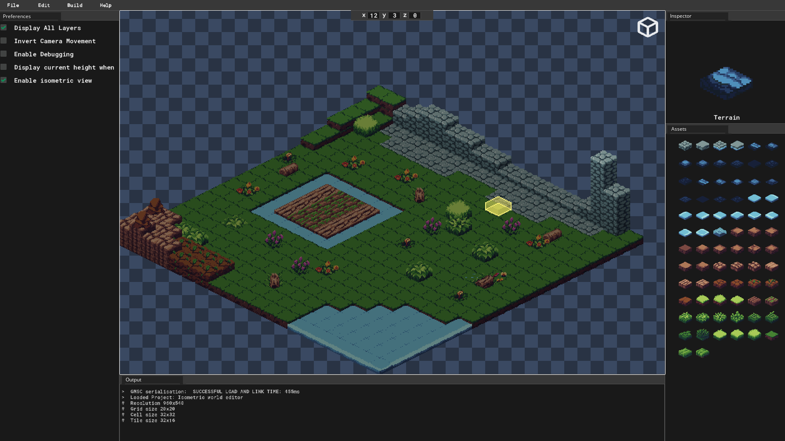

# Isometric Level Editor

A lightweight level creation tool for **GameMaker Studio 2** designed for building 2D levels from an isometric perspective. It provides an intuitive editor for placing tiles, adjusting tile height, switching perspectives, and inspecting level information while designing.

> [!NOTE]
> This project is designed specifically for GameMaker Studio 2 and is intended to simplify the process of creating isometric levels for GameMaker projects.

## Features

- **Isometric Level Editor** — Create and edit levels directly on an isometric grid.
- **Tile Explorer** — Browse and select tiles from available tile sets.
- **Tile Placement** — Easily place and move tiles around the level.
- **Tile Height Control** — Adjust the height of selected tiles for layered environments.
- **2D / Isometric View** — Switch between a traditional 2D view and an isometric perspective.
- **Level Options** — Configure grid and tile-related settings.
- **Output Panel** — Inspect system settings, tile information, and level details while working.
- **Decoration Mode** — Toggle between regular level tiles and decorative tiles.

## Controls

| Input | Action |
|---|---|
| **Left Click** | Place and interact with tiles |
| **Right Click** | Toggle between decoration and normal tile modes |
| **Middle Mouse Button** | Adjust the height of the selected tile |
| **Top-right Button** | Toggle between 2D and isometric views |

## Interface

The editor is split into several areas, each serving a specific purpose:

### Main Window

The main editing area where levels are created. Tiles can be placed and manipulated directly on the grid.

### Explorer Window

Provides access to the available tiles and tile sets. Select a tile here before placing it on the level.

### Options Window

Contains settings that control the level editor, including grid and tile-related properties.

### Output Window

Displays useful information about the current level, selected tiles, and system settings.

## 2D and Isometric Views

The editor supports both traditional 2D and isometric perspectives.

Use the **top-right perspective button** to switch between views. This allows you to work with the level using a conventional grid while also previewing how the final level appears from an isometric perspective.

## Getting Started

### Requirements

- [GameMaker Studio 2](https://gamemaker.io/)

### Installation

1. Clone this repository or download the source code.
2. Open the project in **GameMaker Studio 2**.
3. Run the project.
4. Use the editor to select tiles and begin building your level.

## Usage

1. Select a tile from the **Explorer Window**.
2. Place the tile in the **Main Window**.
3. Adjust its height using the **Middle Mouse Button**.
4. Use **Right Click** to switch between normal and decoration tiles when needed.
5. Configure level settings through the **Options Window**.
6. Switch between **2D and isometric views** to inspect your level from different perspectives.
7. Use the **Output Window** to monitor level and tile information.

## Project Structure

The project is built using **GameMaker Studio 2** and its native project structure. The editor itself is implemented using GameMaker's scripting and rendering systems.

## Roadlevel

Potential future improvements include:

- Level export functionality
- Level import functionality
- Additional tile manipulation tools
- Improved tile-set management
- Layer management
- Level saving and loading
- Additional isometric editing tools

## Contributing

Contributions, suggestions, and bug reports are welcome.

If you find an issue or have an idea for improving the editor, feel free to open an issue or submit a pull request.

## License

This project is licensed under the **MIT License**.
